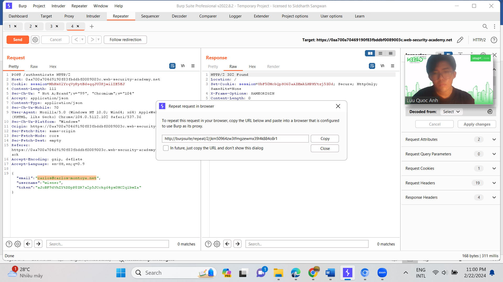
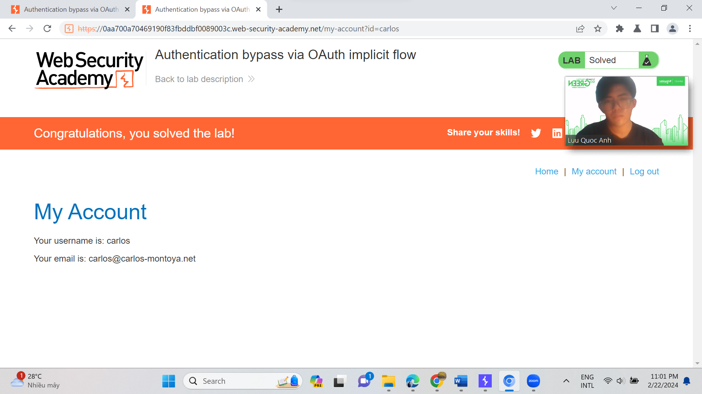

# Access control vulnerabilities - OAuth2.0

**Objective**:

* This lab object is designed to explore and identify vulnerabilities in OAuth implementations. Participants will use a simulated environment where an OAuth 2.0 setup is implemented with intentional security flaws. The objective is to detect, exploit, and suggest mitigations for these vulnerabilities.

In this lab, students need to:

* Answer the following questions:
  * What is OAuth, and how does it facilitate authorization in modern web applications?

OAuth là một giao thức ủy quyền phổ biến được sử dụng trong các ứng dụng web hiện đại để cung cấp phương tiện cho người dùng để chia sẻ tài nguyên hoặc dịch vụ mà họ sở hữu một cách an toàn và bảo mật. OAuth cho phép người dùng cấp quyền truy cập cho các ứng dụng bên thứ ba mà không cần chia sẻ mật khẩu của họ trực tiếp. Thay vào đó, nó sử dụng các mã thông báo ủy quyền để xác thực và ủy quyền truy cập

Cơ chế hoạt động của OAuth như sau:

1. Người dùng yêu cầu truy cập vào một dịch vụ hoặc tài nguyên từ một ứng dụng bên thứ ba.
2. Ứng dụng chuyển hướng người dùng đến nhà cung cấp dịch vụ (service provider) để xác thực.
3. Người dùng đăng nhập vào nhà cung cấp dịch vụ và cấp quyền truy cập cho ứng dụng bên thứ ba.
4. Nhà cung cấp dịch vụ cung cấp một mã thông báo ủy quyền cho ứng dụng bên thứ ba.
5. Ứng dụng bên thứ ba sử dụng mã thông báo ủy quyền này để truy cập các tài nguyên hoặc dịch vụ được yêu cầu mà không cần mật khẩu của người dùng
   * Describe how consent phishing can be executed in an OAuth context. How can attackers leverage OAuth permissions to gain unauthorized access to user data? Discuss strategies that can be employed to detect and prevent consent phishing in OAuth implementations.

* Perform challenge:
  * [Authentication bypass via OAuth implicit flow](https://portswigger.net/web-security/oauth/lab-oauth-authentication-bypass-via-oauth-implicit-flow)
* Explain and capture all steps (full windows screen capture).

This lab uses an OAuth service to allow users to log in with their social media account. Flawed validation by the client application makes it possible for an attacker to log in to other users' accounts without knowing their password.

To solve the lab, log in to Carlos's account. His email address is carlos@carlos-montoya.net.

You can log in with your own social media account using the following credentials:&#x20;

wiener: peter.

ở bài lab này ta sẽ tận dụng lỗ hổng trong validation của OAuth service để đăng nhập vào tài khoản của nạn nhân mà không cần phải biết mật khẩu. ở đây ta đã biết email của nạn nhân là: [carlos@carlos-montoya.net](mailto:carlos@carlos-montoya.net). Để bắt đầu, ta sẽ vẫn đăng nhập như bình thường với tài khoản đã cấp là wiener:peter.

Đăng nhập đã xong, ta sẽ chuyển đến burpsuite để quan sát các gói tin.

Bởi vì đề bài cho ta 1 email của nạn nhân, nên ta sẽ ưu tiên tìm các request có đẩy email lên server. Và request POST /authenticate đã có điều đó. Ta sẽ gửi request này vào repeater.

Tại đây, mình sẽ thay đổi email và request lên server thui!!

Sau khi request lên, ta k thấy response trả về 302/found. Vậy là tìm được tài khoản của nạn nhân. Để cho rõ rang hơn, ta sẽ click phải và chọn request in browser > "In original session". Và bùm!!!

Mình đã thành công đăng nhập vào tk nạn nhân.
