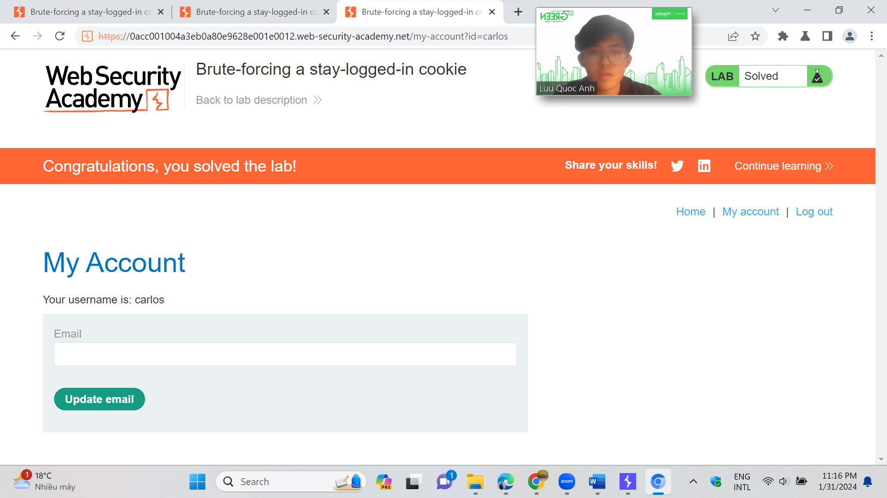
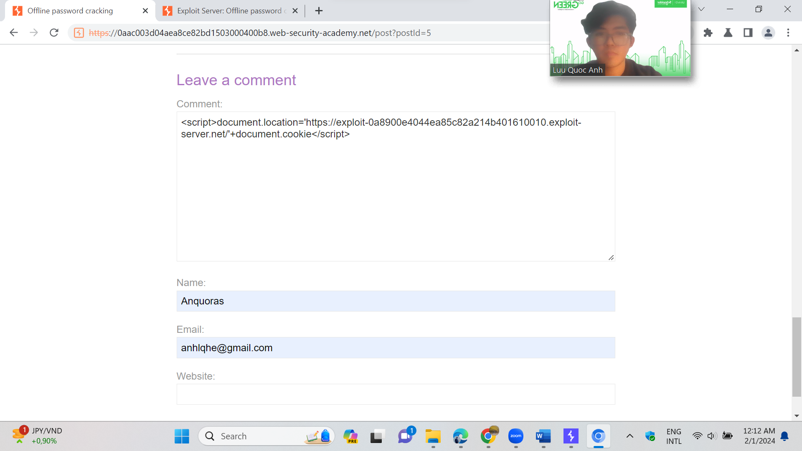
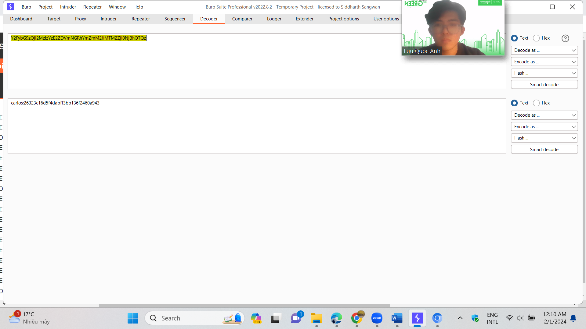

# Authentication Vulnerabilities (other authentication mechanisms)

**Objective**:

* In this section, we'll look at some of the supplementary functionality that is related to authentication and demonstrate how these can be vulnerable.

In this lab, students need to:

* Perform two challenges:
  * [Brute-forcing a stay-logged-in cookie](https://portswigger.net/web-security/authentication/other-mechanisms/lab-brute-forcing-a-stay-logged-in-cookie)
  * [Offline password cracking](https://portswigger.net/web-security/authentication/other-mechanisms/lab-offline-password-cracking)
* Explain and capture all steps (full windows screen capture).
* **Challenge 1:** [Brute-forcing a stay-logged-in cookie](https://portswigger.net/web-security/authentication/other-mechanisms/lab-brute-forcing-a-stay-logged-in-cookie)

This lab allows users to stay logged in even after they close their browser session. The cookie used to provide this functionality is vulnerable to brute-forcing.

To solve the lab, brute-force Carlos's cookie to gain access to his "My account" page.

* Your credentials: `wiener:peter`
* Victim's username: `carlos`
* [Candidate passwords](https://portswigger.net/web-security/authentication/auth-lab-passwords)

.png>)

Đầu tiên, ta sẽ đăng nhập vs username và password mà đề bài đưa ra. Và tích vào phần stay-login

.png>)

Vào burpsuite, tại phần get /account ta thấy một mã tại phần stay-login. Quan sát sang phần inspector ta có: wiener:51dc30ddc473d43a6011e9ebba6ca770. Ta có thể thấy session được tạo bởi username : md5encodingpassword

.png>)

Crack mã md5 tại crackstation ta ra đc mật khẩu mà ta đã nhập vào trước. sau đó ta sẽ gửi request này vào intruder

.png>)

Tại đây, ta sẽ paste list password mà đề bài cho. Tại phần processing payload, ta sẽ thêm

Hash: MD5 -> encode password bằng mã md5

Add Prefix: carlos: -> add carlos: vào đầu mỗi mã

Base64-encode -> encode mã thành base64

.png>)

Sau khi bruteforce, ta quan sát đc 1 payload có kết quả khác các payload còn lại. mở response bằng browser, t đã đăng nhập đc vào tk carlos

Base64 decode session:

Md5 decode -> password: monitoring  &#x20;

* &#x20;                                   Challenge 2: [Offline password cracking](https://portswigger.net/web-security/authentication/other-mechanisms/lab-offline-password-cracking)

This lab stores the user's password hash in a cookie. The lab also contains an XSS vulnerability in the comment functionality. To solve the lab, obtain Carlos's `stay-logged-in` cookie and use it to crack his password. Then, log in as `carlos` and delete his account from the "My account" page.

* Your credentials: `wiener:peter`
* Victim's username: `carlo`

ở challenge này, như các challenge khác ta vẫn sẽ đăng nhập với account wiener:peter. Sau đó ta sẽ vào exploit server

Tiếp theo, copy url của expoit server

Vào comment post của 1 bài bất kì, ta sẽ comment dựa trên cú pháp của html : \

Sau khi post comment, Quay trở lại exploit server và mở access log rồi quan sát. Ta thấy 1 log có chứa nội dung lạ và ip lạ. ta sẽ cop nội dung ở stay-logged-in

Đưa vào decoder bằng base 64, ta đã ra đc tk vs username là carlos

Tiếp tục decode mã hash ở sau, ta có đc mk là : onceuponatime.

Đăng nhập thành công vào tài khoản và xóa mật khẩu. ta đã hoàn thành bài lab

