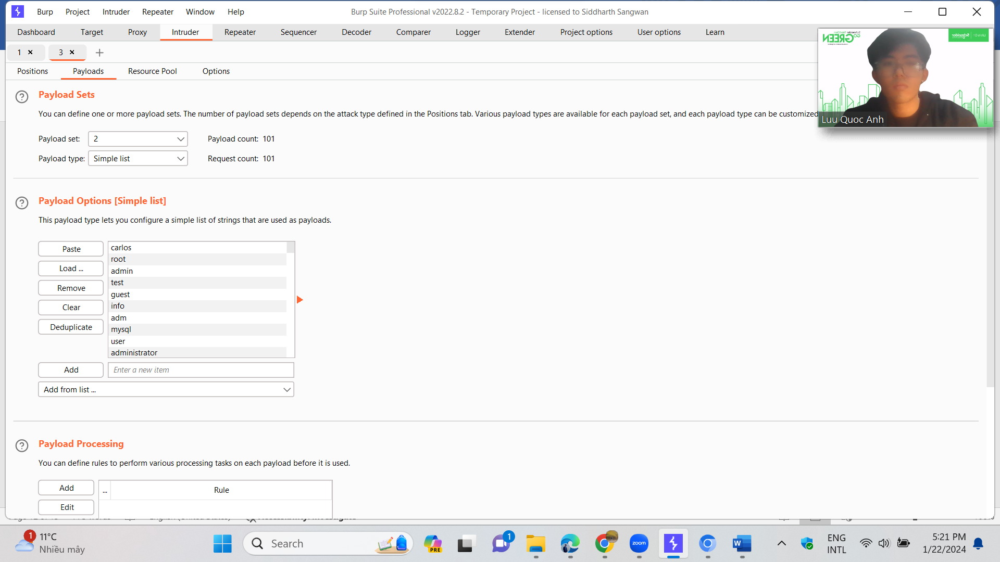
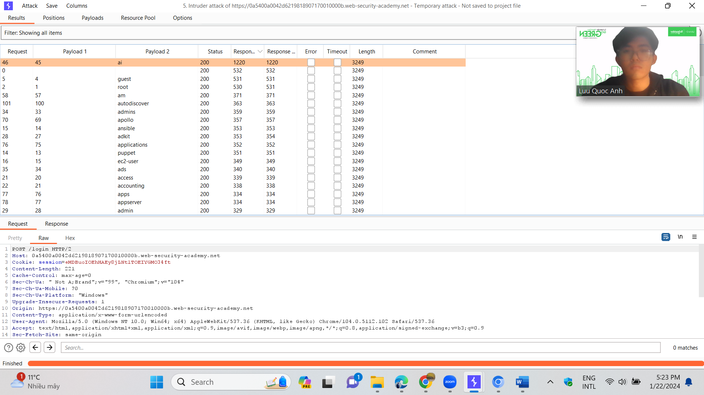
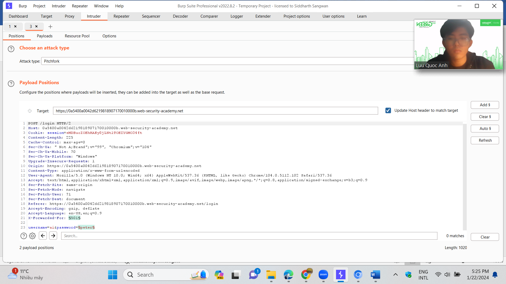
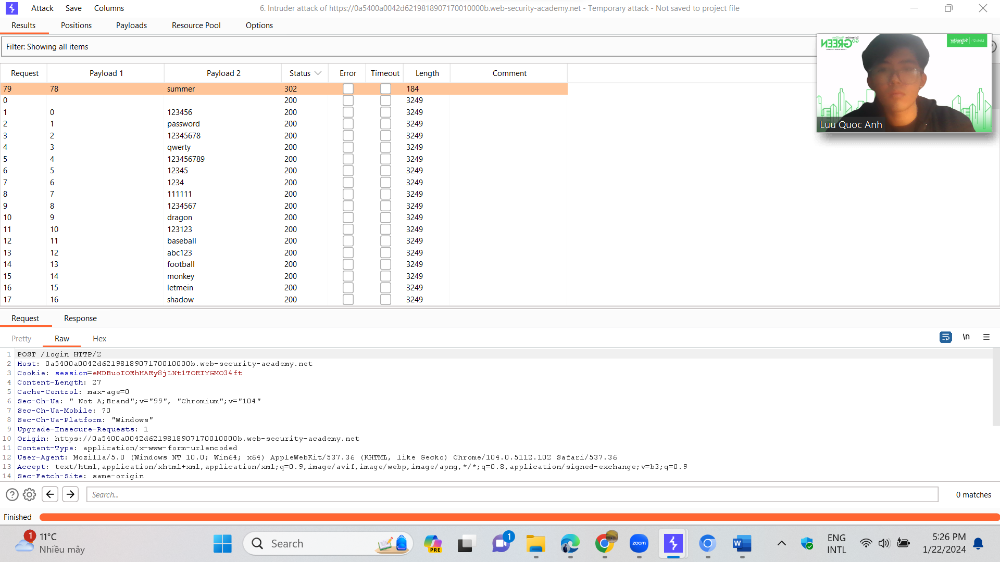
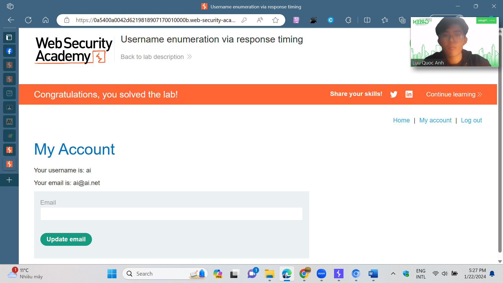

# Authentication Vulnerabilities (password-based)

**Objective**:

* In this section, we'll look more closely at some of the most common vulnerabilities that occur in password-based login mechanisms. We'll also suggest ways that these can potentially be exploited.

In this lab, students need to:

* Perform two challenges:
  * [Username enumeration via different responses](https://portswigger.net/web-security/authentication/password-based/lab-username-enumeration-via-different-responses)
  * [Username enumeration via response timing](https://portswigger.net/web-security/authentication/password-based/lab-username-enumeration-via-response-timing)
* Explain and capture all steps (full windows screen capture).
* &#x20;                        Challenge 1: [Username enumeration via different responses](https://portswigger.net/web-security/authentication/password-based/lab-username-enumeration-via-different-responses)

This lab is vulnerable to username enumeration and password brute-force attacks. It has an account with a predictable username and password, which can be found in the following wordlists:

* [Candidate usernames](https://portswigger.net/web-security/authentication/auth-lab-usernames)
* [Candidate passwords](https://portswigger.net/web-security/authentication/auth-lab-passwords)

To solve the lab, enumerate a valid username, brute-force this user's password, then access their account page.

.png>)

Đọc qua overview của bài lab, ta thấy bài lab tập trung vào việc đánh cắp các username và password của người dùng hợp lệ trong trang web thông qua việc bruteforce. Từ đó, tiến hành khai thác thông tin và các thông tin nhạy cảm.

.png>)

Ta sẽ thử vs 1 username và password bất kì. Và quan sát các gói tin trên burpsuite

.png>)

Từ đây, ta sẽ gửi gói tin về intruder, nơi chúng ta sẽ tiến hành dò username và password. Nói qua về intruder

Intruder ở burpsuite là một công cụ tự động hóa các cuộc tấn công tùy chỉnh chống lại các ứng dụng web1. Nó cho phép bạn định cấu hình các cuộc tấn công gửi đi gửi lại cùng một yêu cầu HTTP, chèn các tải trọng khác nhau vào các vị trí được xác định trước mỗi lần.

.png>) Ta sẽ chèn tham số vào phần username trước để tiến hành dò ra username phù hợp thông qua đăng nhập nếu username đúng mà password sai web sẽ trả về ‘’incorrect password”

.png>)

Bài lab đã cho ta 1 list các username để bruteforce

.png>)

Tại phần payloads, ta sẽ paste danh sách mà tác giả đưa cho vào đây và tiến hành “start attack”.

.png>)

Quan sát kết quả trả về, ta thấy username có tên là “ansible” có độ dài bất thường là 3250 thay vì là 3248 như các username khác. Vì vậy, ta sẽ thử vs username này

.png>)

Kết quả trả về đúng như ta mong muốn. vậy, ta đã biết được username là “ansible”. Vs username này, ta sẽ tiến hành khai thác nốt password của tài khoản.

Thay username trước đó bằng “ansible”, gán biến cho mật khẩu và paste list mật khẩu vào payload. Ta tiến hành bruteforce mật khẩu

.png>)

Kết quả trả về mật khẩu “jordan” có giá trị độ dài bất thường. ta sẽ thử vs mk này.

.png>)

Và chúng ta đã thành công đột nhập vào trang web này vs username: ansible và password:jordan.

Challenge 2: [Username enumeration via response timing](https://portswigger.net/web-security/authentication/password-based/lab-username-enumeration-via-response-timing)

This lab is vulnerable to username enumeration using its response times. To solve the lab, enumerate a valid username, brute-force this user's password, then access their account page.

* Your credentials: `wiener:peter`
* [Candidate usernames](https://portswigger.net/web-security/authentication/auth-lab-usernames)
* [Candidate passwords](https://portswigger.net/web-security/authentication/auth-lab-passwords)

Tương tự như ở challenge trước, chúng ta sẽ thực hiện bruteforce username và password. Tuy nhiên, ở challenge này, việc bruteforce đã trở lên khó khăn hơn do website block ip nếu thực hiện quá nhiều lần đăng nhập như ảnh dưới

.png>)

Website thông báo rằng chúng ta đã thử quá nhiều lần và block ip của ta trong 30 phút. Và để giải quyết vấn đề này, ta sẽ dùng X-Forwarded-For. Đây là 1 header được dùng để giả mạo ip hoặc thay đổi ip của client ip address trong HTTP requests. Với cú pháp X-Forwarded-For:{your ip}

.png>) Với mỗi lần chúng ta thử username và password, ta sẽ thay đổi ip. Qua đó, ta có thể thử nhiều lần mà k sợ website sẽ block.

Quan sát, thấy đề bài cho 1 default username và password wiener:peter.

.png>)\
nếu ở challenge trước, khi ta nhập username đúng và password sai. Website sẽ phản hồi là “incorrect password”. Tuy nhiên, ở challenge này, dù username có đúng thì website vẫn trả về “invalid username or password”. Nhưng, với username đúng, thông qua quan sát mình nhận thấy rằng thời gian website phản hồi sẽ tăng dần nếu ta tăng kí tự password.

.png>)

Với đủ những dữ kiện như vậy, ta đã xác định được cách để bypass qua filter để có thể bruteforce với

Hình thức tấn công là **Pitchfork.**

.png>)

Ta sẽ gán 2 parameter cho username và ip giả để tiến hành brutforce.

.png>)

ở phần payload 1, ta set payload type thành ‘’numbers” và để chạy từ 0-100 vs step là 1.

\
ở payload 2, ta sẽ nhập list username đã cho bởi đề bài và tiến hành attack.

Quan sát response, ta thấy username : “ai” có thời gian phản hồi lâu nhất. vậy, đã xác định được username

Việc còn lại là tìm password, thay đổi parameter sang password. ở payload 2, nhập list password đã cho bởi đề bài

The 302 HTTP status code cho biết đang chuyển hướng tạm thời đến 1 trang web

Username : ai

Password: summer

