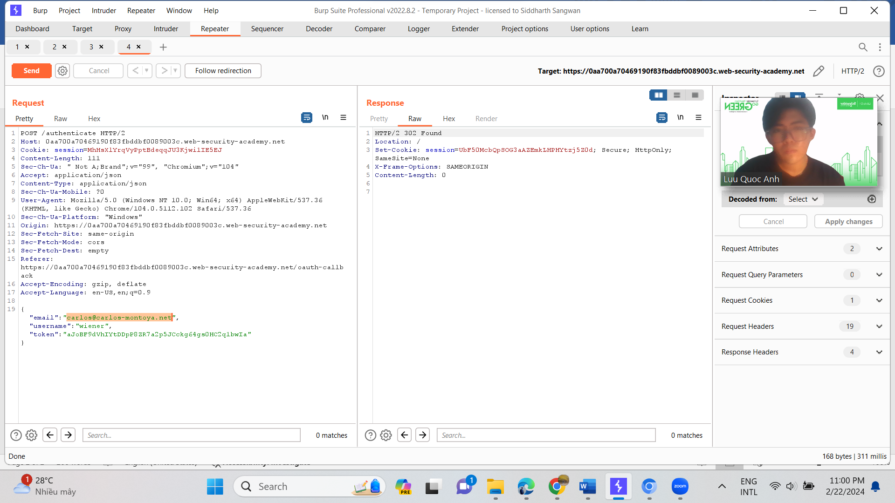
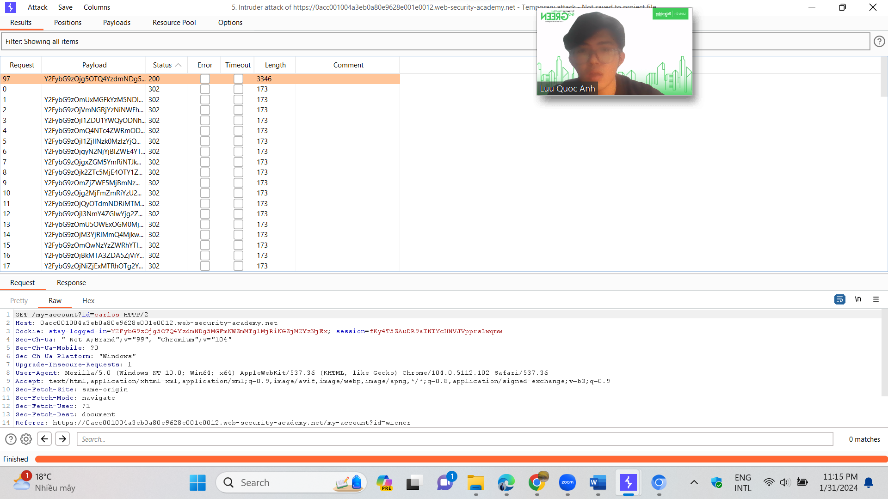
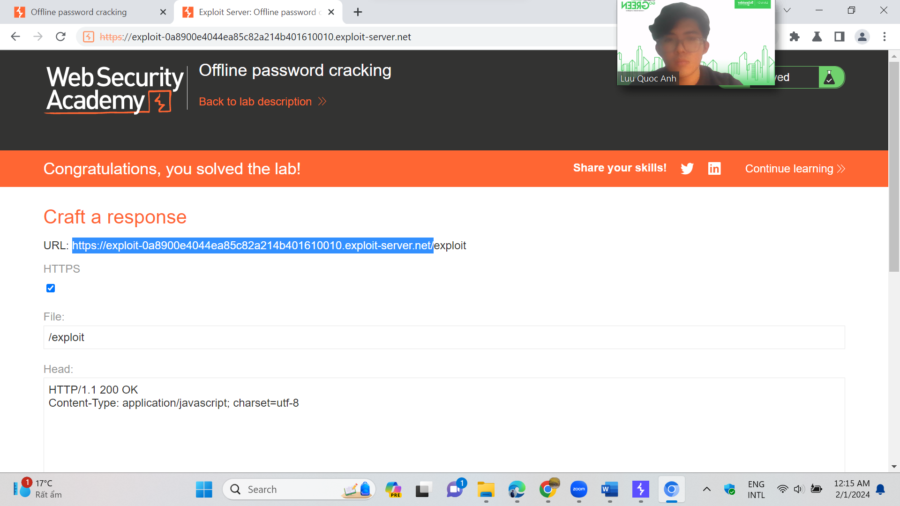
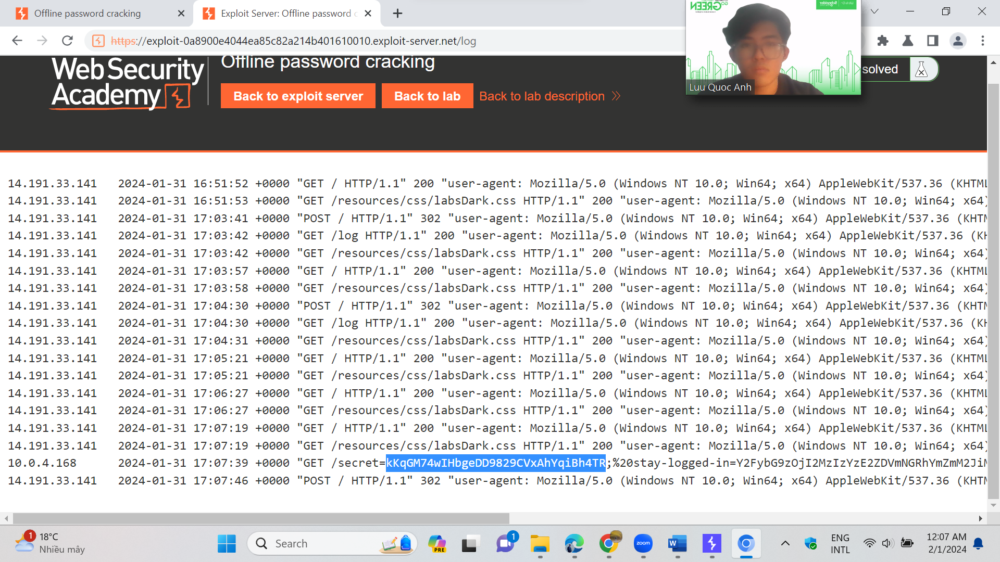

# Information Disclosure Vulnerabilities

* Perform two challenges:
  * [Source code disclosure via backup files](https://portswigger.net/web-security/information-disclosure/exploiting/lab-infoleak-via-backup-files)
  * [Information disclosure in version control history](https://portswigger.net/web-security/information-disclosure/exploiting/lab-infoleak-in-version-control-history)
*   Explain and capture all steps (full windows screen capture).

**Challenge 1:** [Source code disclosure via backup files](https://portswigger.net/web-security/information-disclosure/exploiting/lab-infoleak-via-backup-files)

This lab leaks its source code via backup files in a hidden directory. To solve the lab, identify and submit the database password, which is hard-coded in the leaked source code.

Mục tiêu của bài lab lần này là tìm database password đã bị mã hóa thông qua thư mục backup bị ẩn đi. Đầu tiên, ta truy cập trang web như thông thường đồng thời bật proxy của burpsuite.

Truy cập trên trang web, website thông báo rằng việc truy cập thư mục backup bị chặn.

ở burpsuite, trong target. Ta mở request tới thư mục backup và gửi nó tới repeater.

Sau khi nhận response, ta thấy rằng trang web có chỉ định đến liên kết đến /ProductTemplate.java.bak

Ta chèn thêm vào vần header ở request, và nhận kết quả là 1 đoạn code java. Kéo xuống dưới ta thấy 1 đoạn mã khả nghi

Ta nộp lên phần submission của bài lab và bùm! Ta đã solve được bài lab này.

Code : fafwx0tr7cn5x3a4z4amwt9rohnk6w6w

*

    * Challenge 2 : [Information disclosure in version control history](https://portswigger.net/web-security/information-disclosure/exploiting/lab-infoleak-in-version-control-history)

    This lab discloses sensitive information via its version control history. To solve the lab, obtain the password for the `administrator` user then log in and delete the user `carlos`.

ở bài lab này, theo như sự gợi ý từ tác giả. Ta thấy trang web cung cấp 1 bản git để ta tải về

Trên máy ảo kali, thực hiện command [https://0ac2001d045b6b1f808a148a008c009e.web-security-academy.net/.git](https://0ac2001d045b6b1f808a148a008c009e.web-security-academy.net/.git) để download

Đồng thời, ta sẽ tải thêm git-cola để xem được lịch sử các commit. Cụ thể là commit trong admin.conf của admistrator về password

**Sau khi mở git-cola, ta nhận thấy rằng k thể xem file admin.conf hiện tại. tuy nhiên ta có thể xem lại lịch sử của nó. ở column commit, chọn “undo the last commit”**

**Nhấn “undo the last commit”**

**Ta xem file admin.conf trc đó và biết được password. Cùng vs username là “administrator” ta sẽ đăng nhập vào website**

Ta đã đăng nhập thành công, việc còn lại là xóa user “carlos” ở column “admin panel”

Và ta đã xóa thành công và hoàn thành bài lab !

Username: administrator

Password: kgovt8qmige43vi769ct
