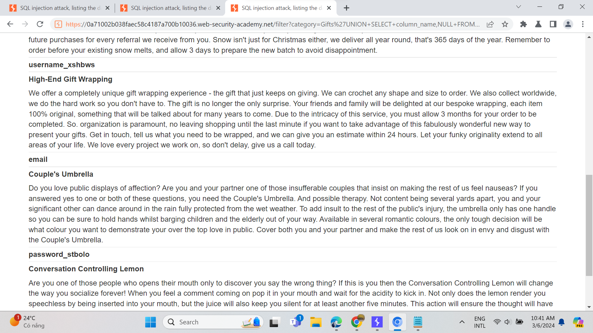

# SQL injection

### Lab: SQL injection vulnerability in WHERE clause allowing retrieval of hidden data

This lab contains a SQL injection vulnerability in the product category filter. When the user selects a category, the application carries out a SQL query like the following:

`SELECT * FROM products WHERE category = 'Gifts' AND released = 1`

To solve the lab, perform a SQL injection attack that causes the application to display one or more unreleased products.

ở bài lab này, ta sẽ tập trung vào tìm kiếm lỗ hổng trong database của 1 website.

<figure><figcaption>
giao diện website
</figcaption></figure>

nhìn qua webstie này ta biết nó trưng bày các mặt hàng. vậy ta sẽ thử click vào một mặt hàng bất kì xem sao.

<figure><figcaption></figcaption></figure>

khi ta chọn accessories, thì trên thanh url của website sẽ hiện category=Accessories. ở đây mình suy nghĩ là "sẽ ra sao nếu chúng ta chèn 1 kí tư lạ vào category"

<figure><figcaption>
website sau khi chèn kí tự lạ
</figcaption></figure>

ở đây mình sử dụng "category=' ". và trang web đã hiện ra lỗi hệ thống thay vì trả về kết quả thông thường như "không tìm thấy " hay hiện ra list đồ. từ đó, ta biết được website đã có lỗi trong database. để khai thác vào lỗi này mình sủ dụng category=%27+OR+1=1--

<figure><figcaption>
kết quả cuộc tấn công
</figcaption></figure>

## Lab: [SQL injection](https://portswigger.net/web-security/sql-injection) attack, querying the database type and version on Oracle

This lab contains a SQL injection vulnerability in the product category filter. You can use a UNION attack to retrieve the results from an injected query.

To solve the lab, display the database version string

&#x20;**Hint**

On Oracle databases, every `SELECT` statement must specify a table to select `FROM`. If your `UNION SELECT` attack does not query from a table, you will still need to include the `FROM` keyword followed by a valid table name.

There is a built-in table on Oracle called `dual` which you can use for this purpose. For example: `UNION SELECT 'abc' FROM dual`

For more information, see our [SQL injection cheat sheet](https://portswigger.net/web-security/sql-injection/cheat-sheet).

<figure><figcaption>
giao diện bài lab
</figcaption></figure>

ở bài lab này, tác giả yêu cầu ta khai thác version của trang web này vả tiết lộ rằng database của trang web này sử dụng phần mềm cùa oracle. đầu tiên ta sẽ thao tác cơ bản với web và bắt gói tin tại burp-suite. tại http history. ta sẽ gửi GET /filter?category=Gifts đến repeater.

<figure><figcaption></figcaption></figure>

tại đây ta sẽ thử tìm lỗi sql thông qua câu lệnh cơ bản '+SELECT+'abc'+FROM+dual-- và trang web trả về lỗi server. câu truy vấn này lỗi bởi vì mình thiếu UNION để thực thi 2 câu truy vấn cùng lúc và cùng với đó mình nhận ra rằng câu truy vấn trả vè một bảng bị lỗi bới vì qua quan sát, mình nhìn thấy nội dung trả về của trang web sẽ là title + script. vì vậy, ta sẽ thay đổi câu truy vấn của mình 1 chút.

<figure><figcaption>
sau khi thay đổi câu truy vấn
</figcaption></figure>

mình sẽ thay đổi thành '+UNION+SELECT+'abc','def'+FROM+dual-- . trang web đã in ra abc def như ta yêu cầu. vì vậy, chúng ta đã tìm được cách ép server in ra mà ta mong muốn. việc còn lại là tìm ra câu lệnh in ra phiên bản của database như yêu cầu.

<figure><figcaption></figcaption></figure>

ta đọc lại hint của đề bài, tác giả đã cho ta 1 cheatseet về SQL Injecttion. và ta đã tìm được câu lệnh trả về version. ở đây loại database mà chúng ta thao tác là của Oracle. &#x20;

SELECT banner FROM v$version. vì vậy câu truy vấn cuối cung của ta sẽ là

'UNION+SELECT+banner,'def'+from+v$version--

<figure><figcaption></figcaption></figure>

vậy ta đã in ra thành công version của website và giải quyết challenge này.
